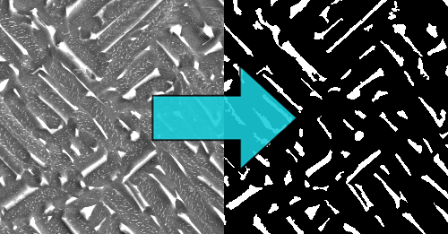
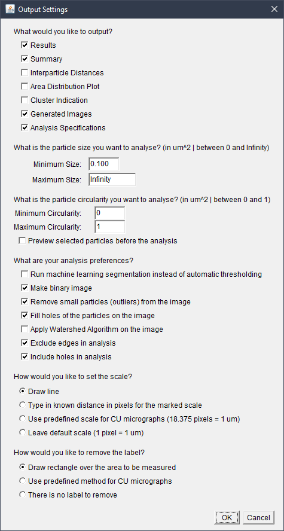

# Automatic Micrograph Analyser

ImageJ macro script that quickly generates a variety of data from 2D micrographs.

You can read the following [post on my blog](https://pawelcislo.com/2018/09/16/how-did-i-automate-micrograph-analysis/) that explains its working in depth, or you can have a look at the [presentation](https://drive.google.com/file/d/1mQZH9pExTbmQhjIbX7bjFtQNP66orTm6/view?usp=sharing).

 

  

## Main Window (settings)

Opening the script results in the following window, where the user can specify his desired analysis settings:

 

  

## Example Input/Output

You can find example input and output data in the [Example_Input_Output](Example_Input_Output) folder of this repository.

## Prerequisites

Please find the scripts in the [Scripts](Required_Files/Scripts) folder. If you cannot download the external plugins from their official websites, you can find them in [Plugins](Required_Files/Plugins) folder.

### Usage Tutorial

 - Text-based tutorial ([User_Manual](User_Manual.pdf))
 - Video-based tutorial, including usage example ([YouTube](https://www.youtube.com/watch?v=GK4SVDmPB0k&width=450&height=253&centervid=1&rel=0&listType=playlist&list=PLMzKVaLgphQcEBCz313qfkpeq3UDqXlAg&plindex=0))
